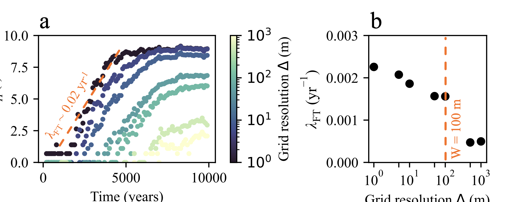
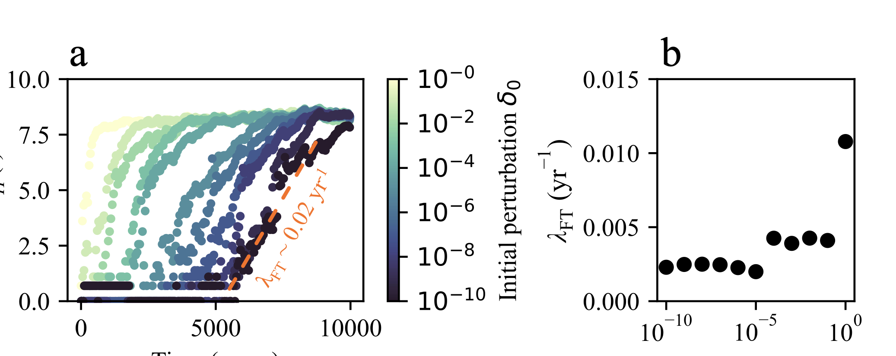
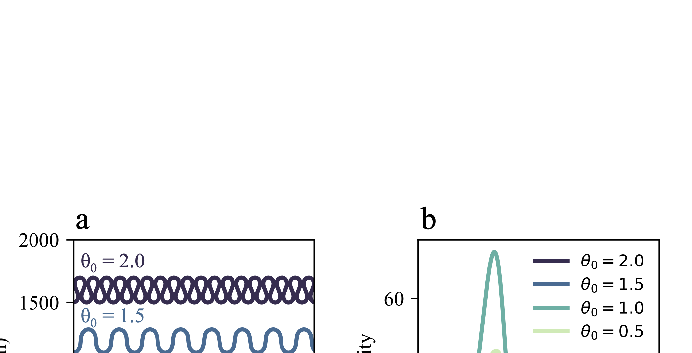
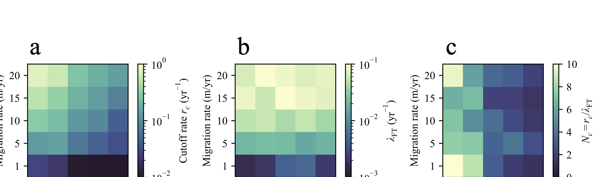

# MeanderChaos

**Cutoffs as a sufficient condition for chaos in kinematic river channel evolution**

Noh, B. & Wani, O. (2025). *Communications Earth & Environment*.

<p align="center">
  
</p>

## Overview

Rivers shape their floodplains through meander growth and cutoffs, which reorganize channel geometry. We test whether cutoffs alone are sufficient to generate deterministic chaos using a kinematic meander model formulated at fixed spatial resolution.

**Key finding:** Trajectories with cutoffs exhibit sustained exponential divergence, whereas those without cutoffs do not. The inferred Lyapunov exponent converges with grid resolution, is insensitive to perturbation magnitude, and is consistent across diverse initial planforms.

<p align="center">
  
</p>

## Repository Structure

```
MeanderChaos/
├── README.md
├── MeanderChaos_Tutorial.ipynb        # Interactive tutorial (start here)
├── scripts/
│   ├── MeanderChaos_Benettin.py       # Benettin algorithm for Lyapunov exponents
│   ├── Gridsize_and_Perturbation_Test.py   # Grid resolution & perturbation sensitivity
│   └── Recurrence_Plot.py             # Recurrence quantification analysis
└── figures/
    ├── codes/                         # Scripts to reproduce paper figures
    │   ├── figure1code.py
    │   ├── figure2code.py
    │   ├── figure3code.py
    │   ├── figure4code.py
    │   └── figure5code.py
    ├── fig1.png ... fig6.png          # Paper figures
    └── ...
```

## Getting Started

### Requirements

```bash
pip install numpy matplotlib scipy cmocean meanderpy
```

### Quick Start

The tutorial notebook walks through the full workflow — paired simulations, Eulerian rasterization, and Hamming distance computation:

```bash
jupyter notebook MeanderChaos_Tutorial.ipynb
```

The tutorial covers three steps that correspond to the core method of the paper:

**Step 1** — Run paired simulations (reference + perturbed) using the Howard--Knutson curvature-driven model via [`meanderpy`](https://github.com/zsylvester/meanderpy)

**Step 2** — Rasterize centerlines onto a fixed Eulerian binary grid and visualize overlap

**Step 3** — Compute the Hamming distance time series to quantify exponential divergence

## Method and Results

### Lagrangian and Eulerian Representations (Fig. 1)

Two simulations are initialized from identical Kinoshita curves, differing by a single-node perturbation ($\delta = 10^{-5}$ m). Since Lagrangian node positions drift independently, direct coordinate comparison is meaningless. Each centerline is rasterized onto a fixed binary occupancy grid:

$$S_{k\ell}(t) = \begin{cases} 1 & \text{if channel occupies cell } (k,\ell) \text{ at time } t \\\\ 0 & \text{otherwise} \end{cases}$$

<p align="center">
  
</p>

> **Fig. 1.** Lagrangian ensemble of 100 realizations (a), and Eulerian representation on grids with resolutions of 10 m (b), 50 m (c), and 100 m (d).

### Cutoffs Control Divergence (Fig. 2)

Without cutoffs, paired trajectories remain coincident indefinitely ($d_H = 0$). With cutoffs enabled, expanding red–blue regions reveal the growth of geometric differences over time.

<p align="center">
  
</p>

> **Fig. 2.** Side-by-side Eulerian maps comparing paired simulations with cutoffs disabled (left) and enabled (right) at four times. Purple: shared cells. Red/blue: divergence.

### Resolution Dependence (Fig. 3)

The finite-time Lyapunov exponent $\lambda_{\mathrm{FT}}$ is estimated from the linear growth window of $\ln d_H(t)$. Growth-rate estimates converge as grid resolution increases and decrease sharply once the grid becomes coarser than the channel width.

$$\lambda_{\mathrm{FT}}(t_1,t_2) = \frac{1}{t_2 - t_1} \ln\!\left(\frac{d_H(t_2)}{d_H(t_1)}\right)$$

<p align="center">
  
</p>

> **Fig. 3.** (a) $\ln d_H(t)$ for grid cell sizes 1–1000 m. (b) $\lambda_{\mathrm{FT}}$ vs. grid resolution.

### Perturbation Sensitivity (Fig. 4)

For perturbations $\delta_0 \le 10^{-1}$ m, the Lyapunov exponent remains $\mathcal{O}(10^{-3})$ yr$^{-1}$, confirming that the divergence rate is independent of perturbation magnitude — a hallmark of deterministic chaos.

<p align="center">
  
</p>

> **Fig. 4.** (A) $\ln d_H(t)$ for perturbations from $10^0$ to $10^{-10}$ m. (B) $\lambda_{\mathrm{FT}}$ vs. $\delta_0$.

### Robustness Across Planforms (Fig. 5)

Sensitive dependence recurs across initial planforms drawn from a Kinoshita family with amplitudes $\theta_0 = 0.5, 1.0, 1.5, 2.0$.

<p align="center">
  
</p>

> **Fig. 5.** (A) Four initial geometries. (B) Distributions of $\lambda_{\mathrm{FT}}$ from ten perturb–reset cycles for each planform.

### What Controls the Lyapunov Exponent? (Fig. 6)

Migration rate controls stretching ($\lambda_{\mathrm{FT}}$ scales with $k_\ell$), while the cutoff threshold controls reset frequency. The topological predictability horizon — the number of cutoffs per Lyapunov time — identifies a maximum of ~10 events in the neck-cutoff regime.

<p align="center">
  
</p>

> **Fig. 6.** Heatmaps of (a) cutoff rate, (b) $\lambda_{\mathrm{FT}}$, and (c) predictability horizon $N_c = r_c / \lambda_{\mathrm{FT}}$ as functions of migration rate and cutoff threshold.

## Scripts

| Script | Description |
|--------|-------------|
| `scripts/MeanderChaos_Benettin.py` | Benettin algorithm for Lyapunov exponents on the Eulerian grid |
| `scripts/Gridsize_and_Perturbation_Test.py` | Sensitivity analysis: grid cell size and perturbation magnitude |
| `scripts/Recurrence_Plot.py` | Recurrence quantification analysis of planform evolution |
| `figures/codes/figure[1-5]code.py` | Reproduction scripts for each paper figure |

## Interactive Demo

An interactive Eulerian occupancy heatmap with adjustable grid resolution is available at:

**[braydennoh.github.io/chaotic-rivers](https://braydennoh.github.io/chaotic-rivers.html)**

## Citation

```bibtex
@article{noh2025cutoffs,
  title   = {Cutoffs as a sufficient condition for chaos in kinematic
             river channel evolution},
  author  = {Noh, Brayden and Wani, Omar},
  journal = {Communications Earth \& Environment},
  year    = {2025}
}
```

## License

MIT
