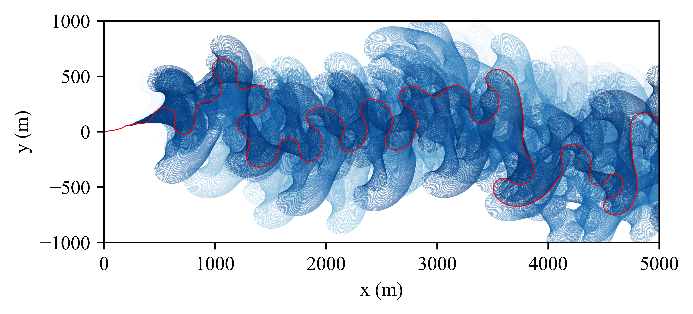
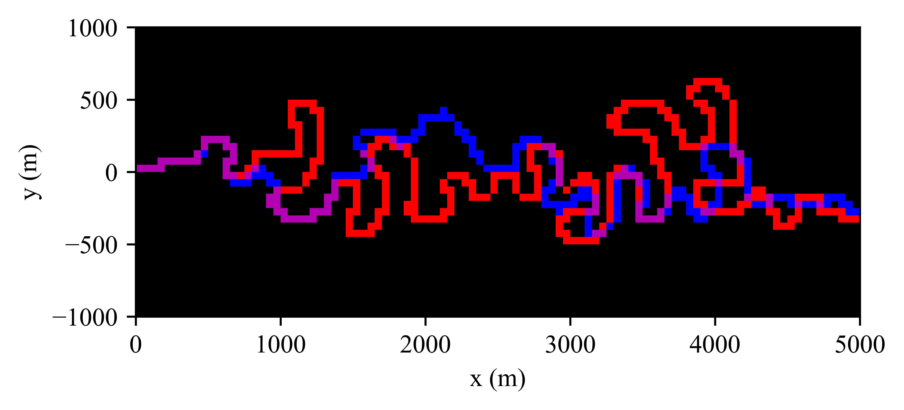
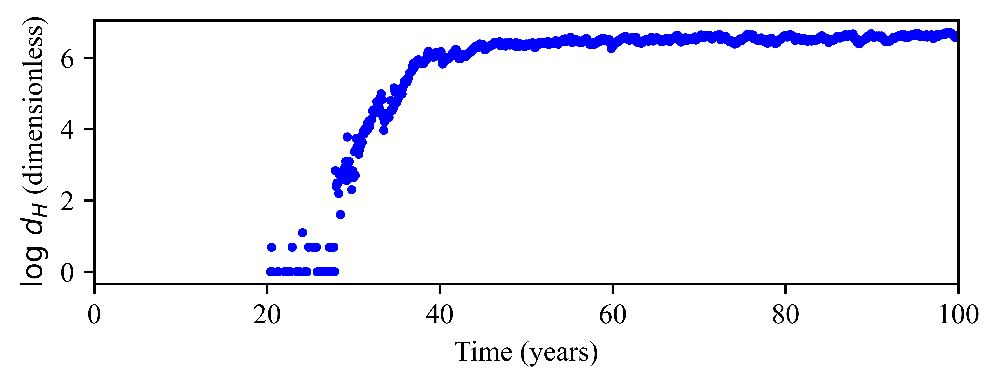

# MeanderChaos


River meanders evolve smoothly most of the time, but neck cutoffs abruptly change planform topology. We test a simple question inside a deterministic geometric model: are cutoffs alone sufficient to produce sensitive dependence on initial conditions (chaos)?

## Usage
Using `meanderpy`, we simulate the planform evolution of a river and apply a localized perturbation to the initial conditions. We then employ an **Eulerian grid analysis** to rasterize the channel centerlines and compute the Hamming distance between the two simulations.

## Dependencies

Ensure you have the following libraries installed:

```python
import numpy as np
import matplotlib.pyplot as plt
import meanderpy as mp
import cmocean
```

-----

## 1\. Simulation Setup

We define the physical constants governing the river migration. The simulation uses a constant flow depth and friction factor. The migration rate is determined by the lateral migration scale $k_l$ and vertical scale $k_v$.

  * **Grid Resolution:** $\Delta t = 0.1$ years
  * **Migration Rate ($k_l$):** $100$ m/yr
  * **Perturbation Magnitude:** $10^{-5}$ m

<!-- end list -->

```python
SECONDS_PER_YEAR = 365.25 * 24 * 3600
NIT = 1001          # Iterations
W = 100.0           # Channel width (m)
MAG = 1e-5          # Perturbation magnitude (m)
CRDIST = 2 * W      # Cutoff threshold

# Migration parameters
KL_M_PER_YR = 100.0
KV_M_PER_YR = 3.16e-5
DT_YEARS = 0.1

# SI Unit Conversion
kl = KL_M_PER_YR / SECONDS_PER_YEAR
kv = KV_M_PER_YR / SECONDS_PER_YEAR
dt = DT_YEARS * SECONDS_PER_YEAR
```

-----

## 2\. Running the Simulation

The `run_sim` function initializes a sine-generated curve parameterized by the angle $\theta(s)$:

$$
\theta(s) = \theta_0 \sin\left(\frac{2\pi s}{\lambda}\right)
$$

We run two instances:

1.  **Reference:** Standard initial conditions.
2.  **Perturbed:** A single-node offset ($y + \delta$) applied at initialization.

<!-- end list -->

```python
def run_sim(pert, crdist):
    # Initialize centerline geometry
    theta0 = 1.5
    n_nodes = 1000
    total_length = 10000.0
    lamb = 500.0
    s = np.linspace(0.0, total_length, n_nodes)
    
    # Generate initial theta and integration for (x,y)
    base_angle = 0.0
    theta = theta0 * np.sin(2.0 * np.pi * s / lamb) + base_angle
    x = np.zeros_like(s)
    y = np.zeros_like(s)
    
    for i in range(1, n_nodes):
        ds = s[i] - s[i - 1]
        x[i] = x[i - 1] + ds * np.cos(theta[i])
        y[i] = y[i - 1] + ds * np.sin(theta[i])

    # Apply perturbation
    if pert != 0.0:
        mid = len(x) // 2
        y[mid] += pert

    # Initialize MeanderPy objects
    z = np.zeros_like(x)
    ch = mp.Channel(x, y, z, W, 1.0)
    chb = mp.ChannelBelt([ch], [], [0.0], [])
    
    # Run migration
    chb.migrate(NIT, 1, 50.0, 0, crdist, np.ones(NIT), 
                0.0065 * np.ones(NIT), kl, kv, dt, 1000, 0, 0, 0, 0.0)
    return chb

# Execute Simulations
chb_ref = run_sim(0.0, CRDIST)
chb_pert = run_sim(MAG, CRDIST)
```

### Visualizing Channel Evolution

We visualize the temporal evolution of the channel centerline. The red line indicates the final state of the unperturbed channel.

<p align="center">
  
</p>

-----

## 3. Eulerian Grid Analysis

To quantify the difference between the Reference and Perturbed channels, we cannot simply subtract coordinate vectors because the nodes drift independently. Instead, we **rasterize** the channels onto a fixed Eulerian grid.

We define a binary occupancy grid $G(x,y)$ where:

$$
G_{i,j} = \begin{cases} 
1 & \text{if channel occupies cell } (i,j) \\ 
0 & \text{otherwise} 
\end{cases}
$$

```python
def rasterize_channel(ch, rows, cols, xmin, ymin, cell_size):
    g = np.zeros((rows, cols), dtype=bool)
    
    # Densify polyline to ensure continuity on grid
    xs = np.linspace(ch.x[:-1], ch.x[1:], 10)
    ys = np.linspace(ch.y[:-1], ch.y[1:], 10)
    
    col_idx = ((xs - xmin) / cell_size).astype(int)
    row_idx = ((ys - ymin) / cell_size).astype(int)
    
    mask = (0 <= col_idx) & (col_idx < cols) & (0 <= row_idx) & (row_idx < rows)
    g[row_idx[mask], col_idx[mask]] = True
    return g

# Example comparison at t=400
t_idx = 400
G1 = rasterize_channel(chb_ref.channels[t_idx], ...)
G2 = rasterize_channel(chb_pert.channels[t_idx], ...)
```

### Spatial Overlap Visualization

The figure below demonstrates the overlap. **Purple** indicates agreement, while **Red** and **Blue** indicate the spatial divergence of the two simulations.

<p align="center">
  
</p>

-----

## 4\. Hamming Distance Quantification

We measure the error growth using the **Hamming Distance** ($d_H$), defined as the count of grid cells where the occupancy states differ:

$$
d_H(t) = \sum_{i,j} | G_{ref}(t)_{i,j} - G_{pert}(t)_{i,j} |
$$

The code calculates $\log(d_H)$ to analyze the exponential divergence typical of chaotic systems.

```python
def get_log_diff(ch1, ch2, cell_size):
    # (Setup grid bounds code omitted for brevity...)
    
    # Rasterize both channels
    g1 = raster(ch1)
    g2 = raster(ch2)

    # Compute Hamming distance
    diff = np.count_nonzero(g1 != g2)
    return np.log(diff) if diff > 0 else np.nan

# Compute over time
log_norms = np.array([
    get_log_diff(chb_ref.channels[t], chb_pert.channels[t], cell_size=50.0)
    for t in range(0, NIT, 1)
])
```

### Divergence Plot

The plot below shows the Log-Hamming distance over time. A linear trend in this semi-log plot would suggest exponential growth of the initial perturbation.

<p align="center">
  
</p>


By comparing paired simulations with identical settings—once with cutoffs enabled and once with cutoffs disabled—we show that only the cutoff-enabled runs develop sustained exponential divergence on a fixed-dimension Eulerian grid. Just add the equation for the Lyapunov on the Eulerian grid.

