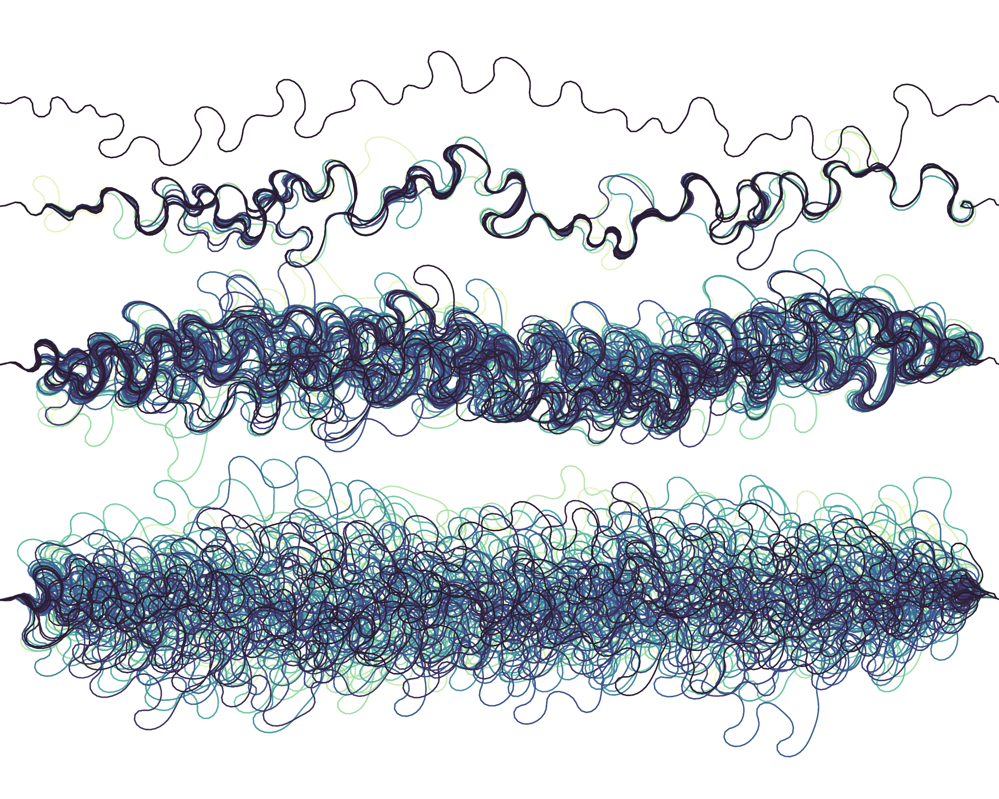
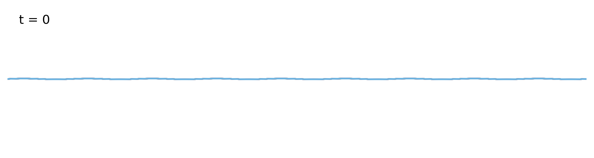
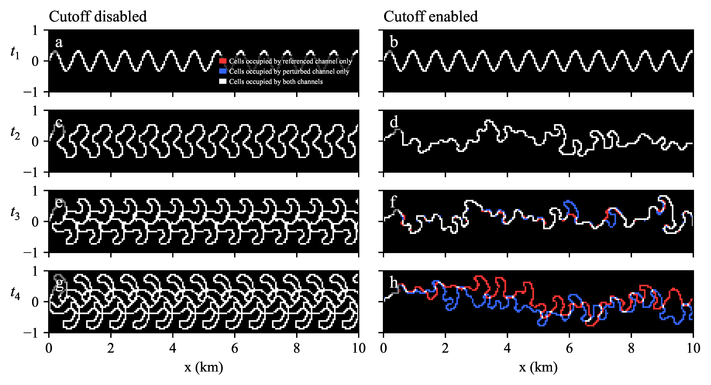

# MeanderChaos

Code and data for: Noh, B. & Wani, O. (2026). [Cutoffs as a sufficient condition for chaos in kinematic river channel evolution](https://www.nature.com/articles/s43247-026-03370-w). *Communications Earth & Environment*.

<p align="center">
  
</p>

## The model

The Howard & Knutson (1984) kinematic meander model represents a river as a Lagrangian centerline of $n$ nodes. We use the open-source implementation [meanderpy](https://github.com/zsylvester/meanderpy) by Sylvester et al. (2019). At each timestep, three operations are applied:

**Migration.** The nominal rate is proportional to dimensionless curvature, $R_0 = k_\ell W \kappa$. The adjusted rate is a weighted sum of upstream curvatures via an exponential convolution kernel $G = e^{-\alpha s}$:

```python
for i in range(pad1, ns-pad):
    si2 = np.hstack((np.array([0]), np.cumsum(ds[i-1::-1])))
    G = np.exp(-alpha * si2)
    R1[i] = omega*R0[i] + gamma*np.sum(R0[i::-1]*G) / np.sum(G)
```

Nodes then move normal to the local tangent: `x += R1 * dy/ds * dt`, `y -= R1 * dx/ds * dt`.

**Cutoff detection.** A pairwise distance matrix is computed via `scipy.spatial.distance.cdist`. Pairs within the diagonal band (adjacent nodes) are masked. The first pair satisfying $\|x_i - x_j\| < d_c$ in row-major order is selected:

```python
dist = distance.cdist(np.array([x,y]).T, np.array([x,y]).T)
dist[dist > crdist] = np.NaN
for k in range(-diag_blank_width, diag_blank_width+1):
    rows, cols = kth_diag_indices(dist, k)
    dist[rows, cols] = np.NaN
i1, i2 = np.where(~np.isnan(dist))
```

No random tie-breakers. `np.where` traverses in row-major order deterministically.

**Topological surgery.** The oxbow is removed by array splicing:

```python
x = np.hstack((x[:ind1[0]+1], x[ind2[0]:]))
y = np.hstack((y[:ind1[0]+1], y[ind2[0]:]))
```

**Resampling.** After cutoff, the centerline is resampled to uniform spacing using a cubic B-spline with zero smoothing:

```python
tck, u = scipy.interpolate.splprep([x,y,z], s=0)
unew = np.linspace(0, 1, 1 + int(round(s[-1]/deltas)))
out = scipy.interpolate.splev(unew, tck)
```

The `s=0` forces exact interpolation. The `round()` in the node count means an infinitesimal perturbation in arc length can change $n$ by one, shifting every node index downstream.

## The variable-dimensionality problem

In Lagrangian coordinates, comparing two centerlines node-by-node is meaningless when they have different $n$. Even when $n$ happens to match, the resampling-induced index shift creates $O(1)$ spurious divergence unrelated to geometry. This motivates a fixed-dimensional state representation.

## Eulerian state representation

We project the Lagrangian centerline onto a fixed binary grid $S_{k\ell}(t) \in \{0,1\}$ of constant dimension. A curve with 1000 nodes and the same curve with 1001 nodes occupy identical grid cells:

```python
def rasterize_channel(ch):
    g = np.zeros((rows, cols), dtype=bool)
    xs = np.linspace(ch.x[:-1], ch.x[1:], 10)
    ys = np.linspace(ch.y[:-1], ch.y[1:], 10)
    col_idx = ((xs - xmin) / cell_size).astype(int)
    row_idx = ((ys - ymin) / cell_size).astype(int)
    mask = (0 <= col_idx) & (col_idx < cols) & (0 <= row_idx) & (row_idx < rows)
    g[row_idx[mask], col_idx[mask]] = True
    return g
```

The Hamming distance $d_H(t) = \|S^*(t) - S(t)\|_1$ measures purely geometric divergence, filtering out resampling mechanics.

## Mechanism: event-driven chaos

The continuous phase (curvature-driven migration) is smooth and non-chaotic on its own. Chaos enters through the discrete phase (cutoffs):

1. Two trajectories separated by $10^{-5}$ m approach a cutoff threshold. One crosses $\|x_i - x_j\| < d_c$ at timestep $N$; the other misses by a fraction of a millimeter and waits until $N+1$.

2. During that one-step delay, the trajectories evolve under different topologies. The first has dropped its oxbow; its downstream nodes integrate over a short, straight neck via `np.sum(R0[i::-1]*G)`. The second retains the loop; its downstream nodes integrate over high-curvature geometry.

3. For that single timestep, downstream migration rates differ by $O(1)$, injecting a meter-scale geometric separation.

4. Once separated by meters, the next cutoff threshold is straddled at an even wider time offset, and the process cascades.

This is the threshold-reset mechanism found in impact oscillators and other hybrid continuous-discrete systems. The continuous dynamics provide stretching; the discrete events provide folding.

<p align="center">
  
</p>

## Counterfactual experiment

The test is a single binary switch: cutoffs on or off. With cutoffs disabled, paired trajectories remain coincident ($d_H = 0$). With cutoffs enabled, $\ln d_H$ grows linearly, yielding a positive finite-time Lyapunov exponent:

$$\lambda_{\mathrm{FT}} = \frac{1}{t_2 - t_1} \ln\!\left(\frac{d_H(t_2)}{d_H(t_1)}\right)$$

The growth rate converges with grid refinement, is insensitive to perturbation magnitude over ten orders of magnitude ($10^{0}$ to $10^{-10}$ m), and persists across Kinoshita planforms with $\theta_0 \in \{0.5, 1.0, 1.5, 2.0\}$. The Lyapunov exponent scales with migration rate $k_\ell$ but is invariant to the cutoff threshold $d_c$, while $d_c$ controls the frequency of topological resets. The predictability horizon saturates at approximately 10 cutoff events in the neck-cutoff regime.

<p align="center">
  
</p>

## Repository structure

```
MeanderChaos/
├── MeanderChaos_Tutorial.ipynb           # Executable walkthrough
├── scripts/
│   ├── MeanderChaos_Benettin.py          # Benettin algorithm for Lyapunov exponents
│   ├── Gridsize_and_Perturbation_Test.py # Resolution and perturbation sensitivity
│   └── Recurrence_Plot.py               # Recurrence quantification analysis
└── figures/
    └── codes/                            # Paper figure reproduction scripts
```

Interactive demo: [braydennoh.github.io/chaotic-rivers](https://braydennoh.github.io/chaotic-rivers.html)

## Citation

```bibtex
@article{noh2026cutoffs,
  title     = {Cutoffs as a sufficient condition for chaos in kinematic
               river channel evolution},
  author    = {Noh, Brayden and Wani, Omar},
  journal   = {Communications Earth \& Environment},
  year      = {2026},
  publisher = {Nature Publishing Group}
}
```
